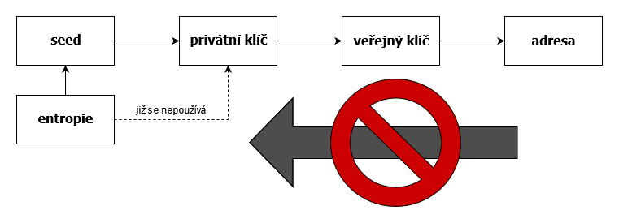

# Bitcoinový slovníček pro mírně pokročilé
**Bitcoin** – název decentralizované P2P sítě sloužící k uchování a přenosu hodnoty. Síť byla spustěna 3. ledna 2009,  když došlo k vytěžení prvního bloku. 

**bitcoin** – v síti přenášená jednotka hodnoty. Protokol stanoví maximální počet 21 milionů bitcoinů. Zkracuje se obvykle jako BTC.

**satoshi** – základní a zároveň nejmenší nejmenší možná jednotka používaná v sítí. 1 bitcoin = 100 000 000 satoshi. Pojmenování vzniklo jako pocta tvůrci vystupujícímu pod pseudonymem Satoshi Nakamoto. Také se zkracuje jako sat, saty, satů, či anglickým plurálem sats. 

**P2P** – zkratka peer-to-peer (volně přeloženo rovný s rovným). Jedná se o síť bez centrálních, či nadřízených uzlů. 

**uzel, node** – zařízení (počítač) tvořící síť. Do bitcoinové sítě je v současnosti (rok 2021) zapojeno na tisíce uzlů. Pokud se uzel neúčastní těžby, má jen minimální nároky na výpočetní výkon a jeho provoz si tak může dovolit široká veřejnost. 

**blockchain** – speciální typ databáze, kde každý nový záznam navazuje (odkazuje) na ten předešlý.

**blok** – předepsaná datová struktura transakcí omezené velikosti (4 000 000 WU; dříve 1 MB). Sestavá se z hlavičky bloku a serializovaných transakcí. 

**hlavička bloku** – sestává se z verze bloku, hashe předchozí bloku, hashe (rootu) merklovského stromu obsažených transakcí, času vytěžení, stanového targetu sítě a nonce – variabilního čísla jehož změnou se dosahuje různých hashů. 

**genesis blok** – první blok bitcoinové sítě vytěžený Satoshim 3. ledna 2009. Jeho coinbase transakce v sobě obsahuje text odkazujcí na legendární novinový titulek "The Times 03/Jan/2009 Chancellor on brink of second bailout for banks". 

**hash (otisk, fingerprint)** – výstup jednosměrné matematické funkce, která libovolně dlouhá data převede číslo s daným rozsahem. Výstupem v Bitcoinu používané funkce SHA256 je 256 bitové číslo, zpravidla zapisované v šestnáctkové soustavě. Příklady:

| vstup | sha256(vstup) |
| ------ | ------ |
| Ahoj | f23e6807b3fb0be0ea999ea8cb88a3e94dc359c84230461f9761efac57dcb081 |
| Ahoy | 491312f2ce2f0d05cc8821956a34138428a72d6cbf3e426ef6bcc87f2905b614 |
| Ahoj, jak se dneska máš? | 56528a982b106e43d1f236360b6a72c4334918c0a83413d810ac0041f8f2e377 |

**peněženka** – software, případně i samostatné hw zařízení, který generuje a uchovává privátní klíče, vytváří a podepisuje transakce.

**HD peněženka** – zkratka hierarchical deterministic; peněženka, která na místo jednotlivých privátních klíčů generuje a uchovává pouze tzv. seed, z kterého pak determisticky odvozuje hierarchistické uspořádání prakticky neomezeného počtu klíčů.  

**slova seedu** – počáteční entropie (zpravidla 128 až 256 bitové číslo) vyjádřená – z důvodů čitelnosti a odolnosti proti chybě při čtení/psaní – variací 12 až 24 slov z 2048 prvkového seznamu. Slova se mohou opakovat a odolnost pro chybě je zvýšena „kontrolní součtem“ (v posledním slově je zakodováno 4 až 8 bitů hashe počáteční entropie).

**seed (semínko)** – počáteční entropie (zpravidla 128 až 256 bitů) rozšířená funkcí PBKDF2 v 512 bitové číslo. Z tohoto čísla jsou následně deterministicky odvozovány všechny klíče (resp. adresy). Levých 256 bitů slouží jako master privátní klíč, pravých 256 bitů se použije jako master chain klíč. Často se slovem „seed“ zjednodušeně označují výše popsaná „slova seedu“.

**asymetrická kryptografie** – způsob šifrování kde je pro zašifrování zprávy použit jiný klíč, než jaký je použit k rozšifrování zprávy. Obráceným použitím klíčů (viz. níže) lze dosáhnout kryptografického podpisu. Bitcoin používá k podepisování transakcí asymetrickou kryptografii eliptických křivek (konkrétně křivku popsanou standardem secp256k1: y2 = x3 + 7).

**privátní klíč (private key)** – ten tajný z dvojce klíčů asymetrické kryptografie. Slouží k rozšifrování tajné zprávy, popř. k podpisu. V případě Bitcoinu se jedná o 256 bitové číslo.

**veřejný klíč (public key)** – druhý z páru. Slouží k zašifrování tajné zprávy, nebo k ověření podpisu. V případě Bitcoinu se jedná o bod na eliptické křivce, který je vypočten násobením stanoveného bodu (tzv. generátor cyklické grupy) a privátního klíče. Jelikož je bitcoinová eliptická křivka souměrná podle osy x, stačí k jeho reprezentaci souřadnice x (256 bitové číslo) a příznak sudosti. 

**bitcoinová adresa** – je to zahashovaný (funkcí SHA256 a následně ještě RIPEMD160) veřejný klíč, případně skript, ve prospěch kterého budou bitcoiny uzamčeny. V minulosti bývala zakódovaná v Base58Check, poslední standard využívá kódování Bech32 se sofistikovanější ochranou před překlepy. K vygenerování adresy není nutná komunikace se sítí, lze ji vygenerovat offline nutný je pouze zdroj entropie (případně již pomocí kvalitní entropie vygenerový seed).  

<figure>
    
    <figcaption>Na počátku je náhoda, na konci adresa. Vracet se však nelze.</figcaption>
</figure>

U adresy vygenerováné standardní cestou s dostatkem počáteční energie je prakticky vyloučeno (teoretická pravděpodobnost je nepředstavitelně nízká), že by již byla někdy vygenerována. Dřív objevíte trpaslíka uprostřed černé díry jak hledá s baterkou vypínač, než aby se vám podařilo z kvalitní entropie vygenerovat již vygenerovanou adresu. 

Příklady různých adres:

| typ | označení | adresa | kódování |
| ------ | ------ | ------ | ------ |
| p2pkh | legacy | 1GRYfroBCL6wJeggD92VdPvJp5vKaVtsrA | Base58Check s počáteční 1 |
| p2sh | nested segwit | 39qmkmoB1t1mjGAowURRimoQduubbhVoZz | Base58Check s počáteční 3 |
| p2wpkh | legacy segwit | bc1ql0t4gka0j9084nz0zrs9sc9tqtf0w29rdh503g | Bech32 s počátečním bc1 |
 
<figure>
    
    <figcaption>QR kód bitcoinové adresy</figcaption>
</figure>

**transakce** – základní operace bitcoinové sítě. Na svém vstupu utrácí (spotřebováva) dosud neutracené výstupy (UTXO) předchozích transakcí. Na svém výstupu uzamyká bitcoiny ve prospěch daných adres a vytváří tak nové UTXO. Potvrzená transakce se stává nesmazatelnou součástí blockchainu (který není nic jiného, než seznam do bloku uspořádáných transakcí). 

**poplatek (fee)** – odměna těžaři za povrzení transakce (zařazení do bloku). Je to rozdíl mezi součtem částek na výstupu a součtem částek na vstupu. Nesmí být záporný a v současné době už ani nulový. 

**mempool** – seznam dosud nepotvrzených transakcí vedený každý uzlem. Těžící uzly z tohoto seznamu vybírají transakce do svých kandidátských bloků, přičemž zpravidla upřednostňují transakce s vyším poměrem poplatek/weight unit. 

**weight unit, WU** – jednotka váhy (velikosti) transkace. Zavedení segwitu stanoví jednotlivým bajtům různých částí transkace jinou váhu, čímž zvýhodňuje právě segwitové transakce, jejichž podpisová data mají vůči předsegwitovým 4x nižší váhu.

**vsize, vbytes, vB** – jiné vyjádření weight unit. 1vB = 4WU. 

**mincetvorná transakce (coinbase transaction)** – speciální transakce, která jako jediná nemá žádné vstupy. Je to první transakce každého bloku, vytváří nové bitcoiny, které jsou společně s poplatky odměnou těžažům. Počet nově vytvořených bitcoinů je pevně stanoveno protokolem sítě, každé přibližně 4 roky dochází k jeho půlení z původních 50 BTC na dnešních 6,25 BTC (rok 2021) až přibližně v roce 2140 dosáhne nuly. 

**segwit** – zkratka segregated witness; vylepšení aktivované formou soft-forku v roce 2017 v síti Bitcoin. Mimo jiného opravuje problém zvaný transaction malleability (trvárnost transakcí) tím, že podpisová data (scriptSig) nejsou součástí serializované podoby transakce, z které je počítán její hash. Mění limit bloku z milionu bajtů (1 MB) na 4 miliony weight unit. Mění se výpočet podpisového hashe, kdy doposud počet vstupů zvyšoval kvadraticky náročnost podepsání/oveření transakce. Atd... 

**soft-fork** – změna pravidel sítě způsobem, který je kompatibilní s uzly, které tuto změnu neimplementují.

**hard-fork** – změna pravidel sítě způsobem, který je nekompatibilní s uzly, které tuto změnu neimplementují. Následkem může být rozštěpení sítě na dvě (či více) různých větví blockchainu. 

**těžení** – v podstatě se jedná o soutěž o právo zápisu dalšího bloku do blockchain. Soutěž vyhraje ten, kdo jako první sestaví takový navazující blok transakcí, jehož hash (resp. hash jeho hlavičky) bude menší, než nastavený cíl (target) sítě. Nalezení takového hashe je věcí náhody, šance se zvyšují se schopností otestovat (zahashovat) co nejvíce variant v co nejmenším čase (ergo s početním výkonem).

**cíl těžby (target)** – 256 bitové číslo stanovící hranici hashe platného bloku. Pouze pokud je hash bloku nižší než toto číslo, může být zařazen do blockchainu. K přepočtu dochází každých 2016 bloků (přibližně každé dva týdny) – na základě doby potřebné k vytěžení posledních 2015 (toto je stále aktivní bug) bloků se upraví target tak, aby docházelo k vytěžení bloku jednou za 10 minut.

**obtížnost sítě (diffuculty)** – vyjádření obtížnosti těžby poměrem genesis targetu / současného targetu

**Satoshi Nakamoto** – pseudonym tvůrce, či snad tvůrců Bitcoinu. Pravá identita je předmětem spekulací. 
<figure>
    
    <figcaption>Andreas Antonopoulos, Luke Dashjr, Nick Szabo, Pieter Wuille, podvodník Craig Wright, Hal Finney, Adam Back, Dorian Satoshi Nakamoto, Greg Maxwell</figcaption>
</figure>
